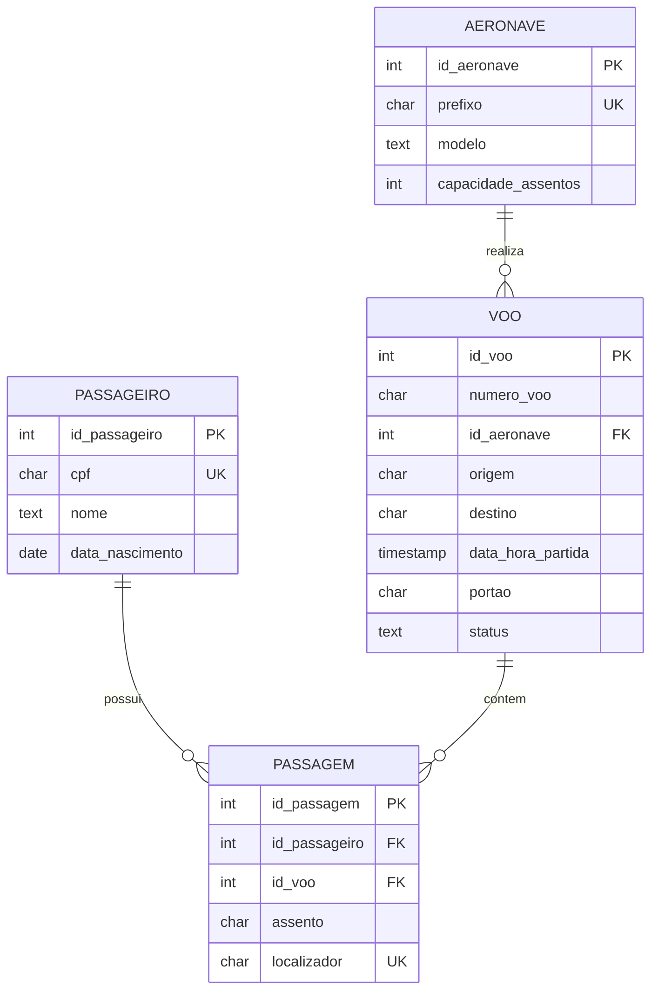

# Modelagem de Dados: Sistema de Aeroporto

Disciplina de Banco de Dados, IDP.
Marcello Azevedo Pinheiro Siqueira, matrícula 24101166.

Entidades dadas: PASSAGEIRO, VOO, AERONAVE.

---

## 1. Definição dos atributos

### PASSAGEIRO

| Atributo | Observação |
| --- | --- |
| `id_passageiro` | Chave primária substituta, inteiro sequencial |
| `cpf` | Chave candidata natural, `UNIQUE`, aceita nulo para passageiro estrangeiro |
| `nome` | `NOT NULL` |
| `data_nascimento` | Necessária para regra de menor desacompanhado e tarifa |
| `email` | Usado para envio de cartão de embarque |
| `telefone` | Contato para alteração de voo |

**Chave primária:** `id_passageiro`.

`cpf` também identifica o passageiro de forma única e poderia ser a chave primária.
Optei pela chave substituta por três motivos: passageiro estrangeiro não tem CPF e
o campo precisaria aceitar nulo, o que a chave primária não permite; CPF é dado
pessoal e replicá-lo como chave estrangeira em todas as tabelas filhas espalha
informação sensível pelo banco; e um inteiro ocupa menos espaço nos índices que
uma string de 11 caracteres. O `cpf` fica como chave candidata, com constraint
`UNIQUE`, preservando a regra de negócio sem virar chave primária.

### VOO

| Atributo | Observação |
| --- | --- |
| `id_voo` | Chave primária substituta |
| `numero_voo` | Código comercial do voo, por exemplo `305` |
| `id_aeronave` | Chave estrangeira para AERONAVE, `NOT NULL` |
| `origem` | Código IATA do aeroporto de partida, por exemplo `BSB` |
| `destino` | Código IATA do aeroporto de chegada |
| `data_hora_partida` | Data e hora juntas, não apenas hora |
| `data_hora_chegada_prevista` | Permite calcular duração e conexão |
| `portao` | Texto, aceita zero à esquerda como `08` |
| `status` | Domínio fechado: Embarque, Confirmado, Aguardando, Cancelado |

**Chave primária:** `id_voo`.

Ponto de atenção que apareceu na atividade da Aula 04: `numero_voo` sozinho não é
chave. O voo 305 acontece todo dia, então `numero_voo` se repete no histórico. A
chave natural real é o par `numero_voo` mais a data de partida, e por isso a
constraint correta é `UNIQUE (numero_voo, data_hora_partida)`, não `UNIQUE (numero_voo)`.

`portao` fica como texto pelo mesmo motivo identificado no exercício anterior:
tem zero à esquerda e é identificador, não quantidade. Ninguém soma portões.

`status` deveria idealmente virar uma tabela própria ou um tipo enumerado, para
impedir que alguém grave "embarcando" em um registro e "Embarque" em outro.

### AERONAVE

| Atributo | Observação |
| --- | --- |
| `id_aeronave` | Chave primária substituta |
| `prefixo` | Matrícula da aeronave, por exemplo `PR-XYZ`, `UNIQUE`, `NOT NULL` |
| `modelo` | Por exemplo `A320neo` |
| `fabricante` | Por exemplo `Airbus` |
| `capacidade_assentos` | Inteiro, usado para validar a lotação do voo |

**Chave primária:** `id_aeronave`.

`prefixo` é a chave natural, análoga à placa de um carro, e fica como `UNIQUE`.

---

## 2. Identificação dos relacionamentos

### PASSAGEIRO e VOO

Um passageiro pode realizar vários voos e um voo pode possuir vários passageiros.

**Cardinalidade: N:N**

### AERONAVE e VOO

Uma aeronave pode realizar vários voos e cada voo é realizado por uma aeronave.

**Cardinalidade: 1:N**, com a aeronave no lado 1 e o voo no lado N.

A chave estrangeira sempre vai para o lado N. Por isso `id_aeronave` fica dentro
de VOO, e não o contrário. Colocar `id_voo` dentro de AERONAVE limitaria cada
aeronave a um único voo na vida.

---

## 3. Resolução do relacionamento N:N

O modelo relacional não representa N:N diretamente. Uma coluna de uma tabela
armazena um valor por linha, então não existe onde guardar a lista de passageiros
dentro de VOO nem a lista de voos dentro de PASSAGEIRO. A solução é decompor o
N:N em dois relacionamentos 1:N ligados por uma tabela intermediária.

Além disso, o atributo `assento` exigido pela regra 5 não pertence ao passageiro
nem ao voo. O passageiro não tem um assento fixo na vida e o voo não tem um único
assento. O assento existe apenas na combinação dos dois, e é a tabela associativa
que dá lugar a ele.

### Nome da tabela

`PASSAGEM`

### Atributos

| Atributo | Tipo de chave |
| --- | --- |
| `id_passagem` | PK |
| `id_passageiro` | FK para PASSAGEIRO, `NOT NULL` |
| `id_voo` | FK para VOO, `NOT NULL` |
| `assento` | Atributo do relacionamento, por exemplo `12A` |
| `localizador` | `UNIQUE`, código de reserva de 6 caracteres |
| `classe` | Econômica, Executiva, Primeira |
| `checkin_realizado` | Booleano |

Constraints adicionais:

- `UNIQUE (id_passageiro, id_voo)` impede o mesmo passageiro em dois assentos no
  mesmo voo, que é o desafio no fim desta atividade
- `UNIQUE (id_voo, assento)` impede dois passageiros no mesmo assento do mesmo voo

A segunda constraint não foi pedida no enunciado, mas sem ela o modelo permite
overbooking físico do mesmo lugar, o que é o erro simétrico do primeiro.

---

## 4. Modelo lógico

```text
PASSAGEIRO
----------------
id_passageiro PK
cpf UNIQUE
nome
data_nascimento
email
telefone
```

```text
AERONAVE
----------------
id_aeronave PK
prefixo UNIQUE
modelo
fabricante
capacidade_assentos
```

```text
VOO
----------------
id_voo PK
numero_voo
id_aeronave FK
origem
destino
data_hora_partida
data_hora_chegada_prevista
portao
status
UNIQUE (numero_voo, data_hora_partida)
```

```text
PASSAGEM
----------------
id_passagem PK
id_passageiro FK
id_voo FK
assento
localizador UNIQUE
classe
checkin_realizado
UNIQUE (id_passageiro, id_voo)
UNIQUE (id_voo, assento)
```

### Diagrama



O N:N original virou dois relacionamentos 1:N convergindo em PASSAGEM.

---

## 5. Questões finais

### Questão 1: por que não colocar `id_passageiro` dentro de VOO?

Porque a coluna comporta um valor por linha, e isso transformaria o
relacionamento em 1:N com o voo no lado N. O modelo passaria a afirmar que cada
voo transporta exatamente um passageiro, o que contradiz a regra 2.

Existem duas tentativas comuns de contornar isso e as duas quebram o modelo.

A primeira é guardar vários IDs na mesma coluna, algo como
`id_passageiro = "12,45,88"`. Isso viola a primeira forma normal, que exige valor
atômico. Não dá para fazer `JOIN`, não dá para indexar, não dá para contar
passageiros sem partir string, e não existe integridade referencial: nada impede
gravar o ID 999 que não existe.

A segunda é repetir a linha do voo, uma para cada passageiro. Aí todos os dados
do voo, origem, destino, horário, portão e status, ficam duplicados em centenas
de linhas. Isso gera as três anomalias clássicas: alterar o portão exige atualizar
todas as linhas e basta uma falhar para o banco ficar inconsistente; apagar o
último passageiro apaga o voo junto; e cadastrar um voo ainda sem passageiros se
torna impossível, porque não existe linha para criar.

Além disso, o atributo `assento` continuaria sem lugar. Ele não descreve o voo,
descreve a ocupação de um passageiro naquele voo.

### Questão 2: por que precisamos de uma tabela associativa?

Por três motivos que se somam.

O modelo relacional não expressa N:N diretamente. A única forma de ligar duas
tabelas é a chave estrangeira, que aponta para exatamente um registro. Um
relacionamento em que os dois lados são múltiplos precisa ser decomposto em dois
relacionamentos 1:N, e a tabela do meio é onde eles se encontram.

O relacionamento tem atributos próprios. `assento`, `localizador` e `classe` só
fazem sentido no cruzamento de um passageiro com um voo específico. Sem a tabela
associativa não existe lugar correto para eles.

A tabela associativa preserva a integridade referencial nas duas pontas. Toda
linha de PASSAGEM referencia um passageiro que existe e um voo que existe, e o
banco recusa a gravação em caso contrário. É também nela que ficam as constraints
que traduzem as regras de negócio do embarque.

Vale notar que PASSAGEM não é apenas um artifício técnico. Ela é uma entidade real
do domínio, tem nome no mundo, tem código próprio e tem ciclo de vida. Nem toda
tabela associativa é assim, muitas são só o par de chaves, mas quando o
relacionamento carrega atributos ela costuma ser uma entidade que estava
escondida na modelagem inicial.

### Questão 3: diferença entre chave primária e chave estrangeira

A chave primária identifica unicamente cada linha dentro da própria tabela. É
única, não aceita nulo e existe uma por tabela. Sua função é distinguir registros.

A chave estrangeira é uma coluna que referencia a chave primária de outra tabela.
Pode repetir, geralmente pode ser nula quando o relacionamento é opcional, e uma
tabela pode ter várias. Sua função é conectar registros e garantir integridade
referencial.

| | Chave primária | Chave estrangeira |
| --- | --- | --- |
| Função | Identificar a linha | Referenciar outra tabela |
| Valores repetidos | Não | Sim |
| Aceita nulo | Não | Depende da obrigatoriedade |
| Quantidade por tabela | Uma | Várias |
| Índice | Criado automaticamente | Recomendado, nem sempre automático |

Em VOO, `id_voo` é a chave primária e `id_aeronave` é chave estrangeira. Vários
voos apontam para a mesma aeronave, então `id_aeronave` repete em VOO, mas é único
na tabela AERONAVE, onde é chave primária. O mesmo valor exerce papéis diferentes
dependendo de qual tabela está sendo olhada.

A integridade referencial é o que a chave estrangeira compra: o banco recusa
inserir um voo com `id_aeronave` inexistente, e recusa apagar uma aeronave que
ainda tem voos, a menos que a política de `ON DELETE` diga outra coisa.

---

## Desafio: impedir que um passageiro ocupe dois assentos no mesmo voo

A regra é violada por duas linhas de PASSAGEM com o mesmo `id_passageiro` e o mesmo
`id_voo`, e assentos diferentes. Basta impedir a repetição do par:

```sql
ALTER TABLE PASSAGEM
    ADD CONSTRAINT uq_passageiro_voo UNIQUE (id_passageiro, id_voo);
```

A partir daí o banco recusa a segunda inserção. A regra passa a valer sempre,
independente de qual sistema está gravando, e não depende de a aplicação lembrar
de conferir. Validação em código pode ser esquecida em uma rota nova, contornada
por script de correção ou perdida numa condição de corrida entre dois check-ins
simultâneos. A constraint não tem esse problema, porque o próprio banco a avalia
dentro da transação.

Uma alternativa é usar chave primária composta, dispensando o `id_passagem`:

```text
PASSAGEM
----------------
id_passageiro PK, FK
id_voo PK, FK
assento
localizador UNIQUE
classe
```

Isso resolve pelo mesmo mecanismo, já que a chave primária é única por definição.
Fica mais enxuto e é a forma clássica de modelar tabela associativa.

Escolhi manter `id_passagem` como chave substituta porque a chave composta precisa
ser replicada inteira em qualquer tabela filha. Uma tabela `BAGAGEM`, por exemplo,
carregaria duas colunas para referenciar a passagem em vez de uma, e o problema
cresce a cada nível. Com chave substituta, a referência é sempre uma coluna só.

Vale registrar o limite da solução: a constraint impede dois assentos no mesmo voo,
mas não impede o mesmo passageiro em dois voos que partem no mesmo horário de
aeroportos diferentes. Isso é uma regra temporal, envolve comparar
`data_hora_partida` entre registros distintos, e `UNIQUE` não alcança. Precisaria
de trigger, constraint de exclusão ou validação na aplicação.

---

## Apêndice: modelo lógico em DDL

Não foi pedido, mas é a tradução direta do modelo acima e facilita testar as
constraints.

```sql
CREATE TABLE PASSAGEIRO (
    id_passageiro   SERIAL PRIMARY KEY,
    cpf             CHAR(11) UNIQUE,
    nome            VARCHAR(120) NOT NULL,
    data_nascimento DATE,
    email           VARCHAR(120),
    telefone        VARCHAR(20)
);

CREATE TABLE AERONAVE (
    id_aeronave         SERIAL PRIMARY KEY,
    prefixo             VARCHAR(10) UNIQUE NOT NULL,
    modelo              VARCHAR(50),
    fabricante          VARCHAR(50),
    capacidade_assentos INTEGER CHECK (capacidade_assentos > 0)
);

CREATE TABLE VOO (
    id_voo                     SERIAL PRIMARY KEY,
    numero_voo                 VARCHAR(10) NOT NULL,
    id_aeronave                INTEGER NOT NULL REFERENCES AERONAVE (id_aeronave),
    origem                     CHAR(3) NOT NULL,
    destino                    CHAR(3) NOT NULL,
    data_hora_partida          TIMESTAMP NOT NULL,
    data_hora_chegada_prevista TIMESTAMP,
    portao                     VARCHAR(5),
    status                     VARCHAR(20) NOT NULL,
    CONSTRAINT uq_voo_data  UNIQUE (numero_voo, data_hora_partida),
    CONSTRAINT ck_rota      CHECK (origem <> destino),
    CONSTRAINT ck_status    CHECK (status IN ('Embarque', 'Confirmado',
                                              'Aguardando', 'Cancelado'))
);

CREATE TABLE PASSAGEM (
    id_passagem       SERIAL PRIMARY KEY,
    id_passageiro     INTEGER NOT NULL REFERENCES PASSAGEIRO (id_passageiro),
    id_voo            INTEGER NOT NULL REFERENCES VOO (id_voo),
    assento           VARCHAR(4),
    localizador       CHAR(6) UNIQUE,
    classe            VARCHAR(20),
    checkin_realizado BOOLEAN DEFAULT FALSE,
    CONSTRAINT uq_passageiro_voo UNIQUE (id_passageiro, id_voo),
    CONSTRAINT uq_voo_assento    UNIQUE (id_voo, assento)
);
```
